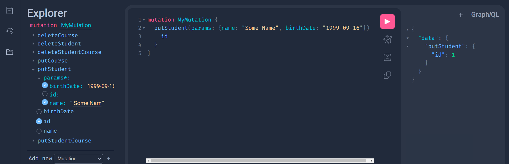
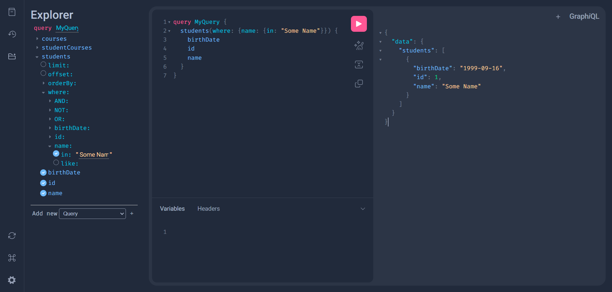


## Let's Code

### File Structure

I like to use a folder to store all my model classes and write one class per file, in our tutorial we will have a `main.py` file and a `models` file.

### Create  some models

First, create classes to represent our database tables.

```Python  
# models.py
{!./examples/tutorial/basic/models.py!}
```

/// note

`Graphemy` class inherit `SQLModel` class. For more details: [SQLModel](https://sqlmodel.tiangolo.com/).

All params of `Graphemy` are in [Model API](../api/Models.md)

///

/// info

To help the imports you can import `Field` from graphemy, that is the same of `SQLModel`


///

### Setting a server

Then, create a router based on this query and import it in a fastapi app.

```Python hl_lines="9 20-22"
{!./examples/tutorial/basic/main.py!}
```

/// note

`GraphemyRouter` class inherit `GraphQLRouter` class. For more details: [Strawberry](https://strawberry.rocks/).

You can pass a dict to engine in `GraphemyRouter` to use tables of differents databases in the same api, in this case you need to set `__enginename__` attribute of your `Graphemy` models. (Default `__enginename__` value is `'default'`).

All params of `GraphemyRouter` are in [Router API](../api/Router.md)


///


/// info

`graphemy` provide a `import_files` function, that imports all `Graphemy` models in the folder that is passed.


///


## Running

### Start FastApi

Run `uvicorn main:app` in the project's folder and access `localhost:8000/graphql` in your browser to see the strawberry debugger server.

### Run Query

Now you have queries, put and delete mutations for both classes created

{ width="800" .center}

Note that every query already have a filter option where you can filter results by every column.

{ width="800" .center}


/// note

Put mutation can receive a id or not, if receive an id this endpoint will search for some item with this id and update it, if you don't put an id or it dont found some item with the inputed id, it will create a new item.

///
