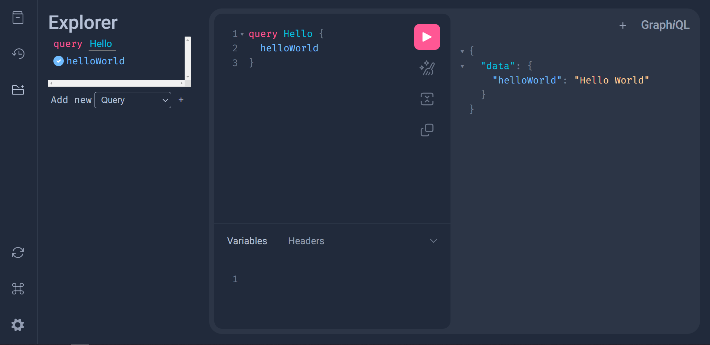


## Let's Code

### Create a Query class

Now, lets create a `main.py` file in our project and create a class for our queries, in this case we have a simple "hello word".

```Python 
# main.py
{!./examples/basic/main.py[ln:1-6]!}

# More code here later 👇
```

<details>
<summary>👀 Full file preview</summary>

```Python
{!./examples/basic/main.py!}
```

</details>

### Setting a server

Then, create a router based on this query and import it in a fastapi app.

```Python hl_lines="9-16"
{!./examples/basic/main.py!}
```

## Testing

### Start FastApi

Run `uvicorn main:app` in the project's folder and access `localhost:8000/graphql` in your browser to see the strawberry debugger server.

### Run Query

Now you can mark helloWord in the query navigator to test our query

{ width="800" .center}